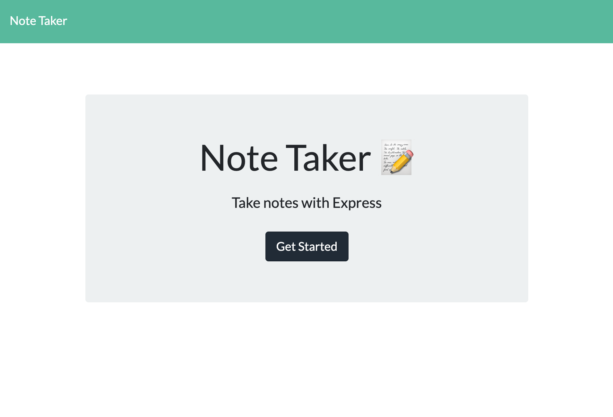
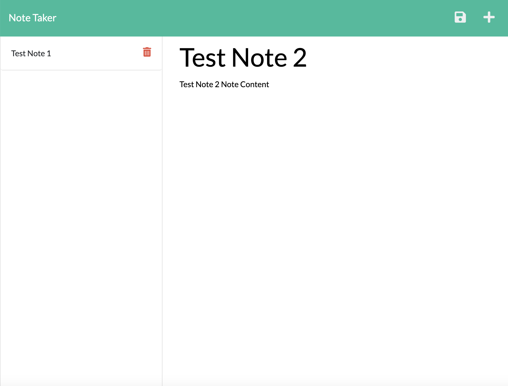

# NOTE TAKER 

  ## <a id="Description">Description</a> 

  This is an app built with node.js with the help of the express package that allows you to take and save notes.
  
  Upon page load, click on "Get Started", and you'll be taken to the note-taking page, where all your previously saved notes will be displayed on the left-side column, each one accompanied by a delete button. When you click on the delete button, that note will be removed and its data deleted from the notes database. If there is no more notes left in the saved list, the message "No Saved Notes" will be displayed.

  To enter a new note, click on "Note Title" on the right-side column to type in the note title, and likewise for the note text. Upon completion of both text boxes, a save button will appear at the top-right corner of the page. Click on the save button so that the text content (along with the note's date and time) will be saved into the database and the left-side column will be re-rendered to include the title of the note you just saved. 

  To view the full content of your previously-saved notes, simply click on the note title on the left-side column, and its content will be displayed on the right-side column. If you wish to add a new note, click on the "+" button on the top-right corner of the page to begin entering a new note. 

  Rendering saved notes is achieved by GET requests from the front-end to the server, while saving new notes is done via POST requests and removing previously-saved notes by DELETE requests. 

  
  App screenshots:
  

  

***

  ## Table of Content

  ### [Description](#Description)
  ### [Installation](#Installation)
  ### [Usage](#Usage)
  ### [License](#License)
  ### [Contributing](#Contributing)
  ### [Tests](#Tests)
  ### [Questions](#Questions)

***

  ## <a id="Installation">Installation</a>

  N/A

***

  ## <a id="Usage">Usage</a>

  Use this app to take and save notes.

***

  ## <a id="License">License</a>
  
  This App is covered under the MIT license.

  
***

  ## <a id="Contributing">Contributing</a>

  Please refer to the Question section of this README for my contact information if you'd like to contribute to this project!

***

  ## <a id="Tests">Tests</a>

  N/A
  

***

  ## <a id="Questions">Questions</a>

  For more info on my work, please check out my GitHub page at: https://github.com/feddericowayne
  
  Should you have any further questions regarding this App, please don't hesitate to reach out to me via email at: <a href="mailto:jackiew1120@hotmail.com">jackiew1120@hotmail.com</a>

  